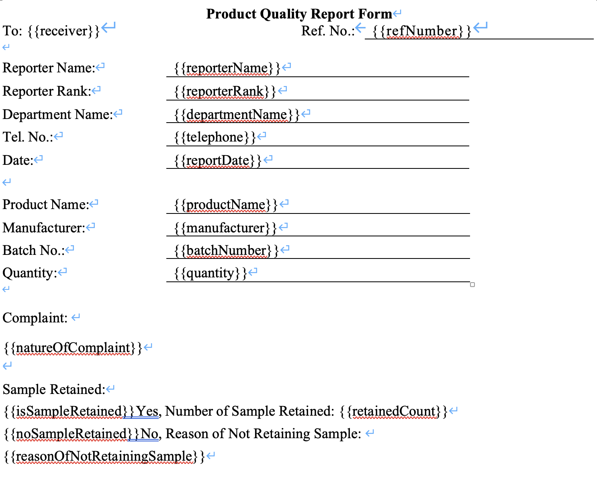
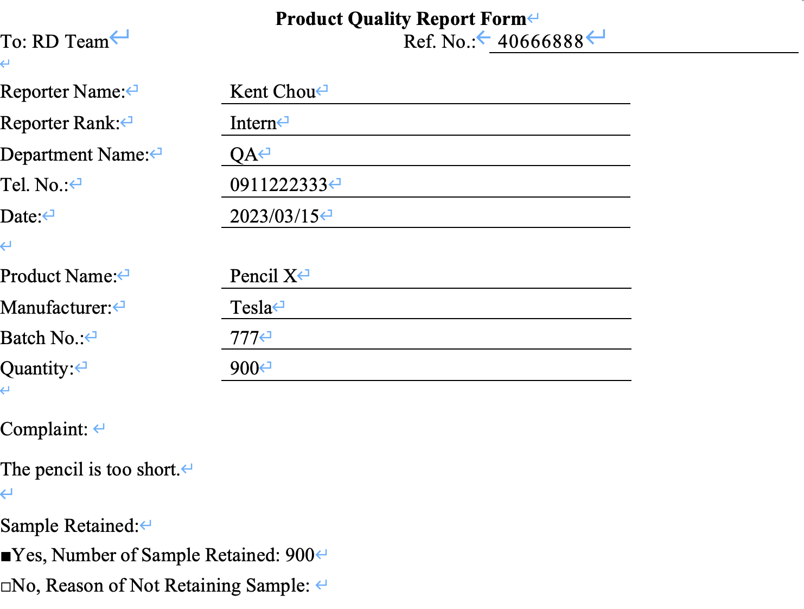

# Go DOCX Template Kit
A Go Library provides tools for manipulate .docx file. using template literal to generate .docx file based on provided data model.

```bash
go get -u github.com/raaaaaaaay86/go-docx-kit/
```

## TemplateKit
Using `{{key-name}}` to specify the position which will be replaced by provided data.

Place `{{key-name}}` in your .docx file.  


See it in action:  
```go
func main() {
	docxFile, err := docx.ReadDocxFile("template.docx")
	if err != nil {
		panic(err)
	}

	model := template.NewTemplateModel()
	model.Put("receiver", "RD Team")
	model.Put("refNumber", "40666888")
	model.Put("reporterName", "Kent Chou")
	model.Put("reporterRank", "Intern")
	model.Put("departmentName", "QA")
	model.Put("telephone", "0911222333")
	model.Put("reportDate", "2023/03/15")
	model.Put("productName", "Pencil X")
	model.Put("manufacturer", "Tesla")
	model.Put("batchNumber", "777")
	model.Put("quantity", "900")
	model.Put("natureOfComplain", "The pencil is too short.")
	model.Put("isSampleRetained", "■")
	model.Put("noSampleRetained", "□")
	model.Put("retainedCount", "900")
	model.Put("reasonOfNotRetainingSample", " ")

	templateKit := template.NewTemplateKit()

	err = templateKit.Render(docxFile, model)
	if err != nil {
		panic(err)
	}

	file, err := docxFile.ToFile("output.docx")
	if err != nil {
		panic(err)
	}

	fmt.Println(file.Name())
}
```
- Create a new `TemplateModel` and put each value with a key which corresponding to the template literal key in the template file.
- Read the template file by using `docx.ReadDocxFile("to/template/path")`.
- Create `TemplateKit` by `NewTemplateKit()`
    - Call `TemplateKit.Render()` and pass template `DocxFile` and `TemplateModel` in arguments.
- Call `DocxFile.ToFile()` to output the result file.

The result .docx file will output like this:
